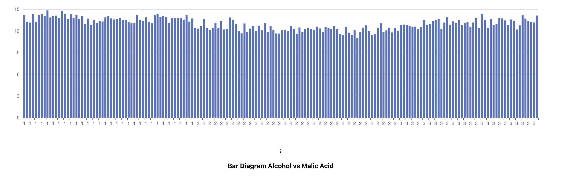
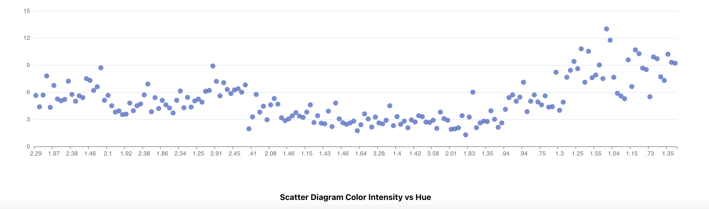

# Data Visualization Task

In the project directory, after installing dependency you can run:

##### `yarn start`

Runs the app in the development mode.\
Open [http://localhost:3000](http://localhost:3000) to view it in the browser.

## Bar Diagram

## Scatter Diagram 

